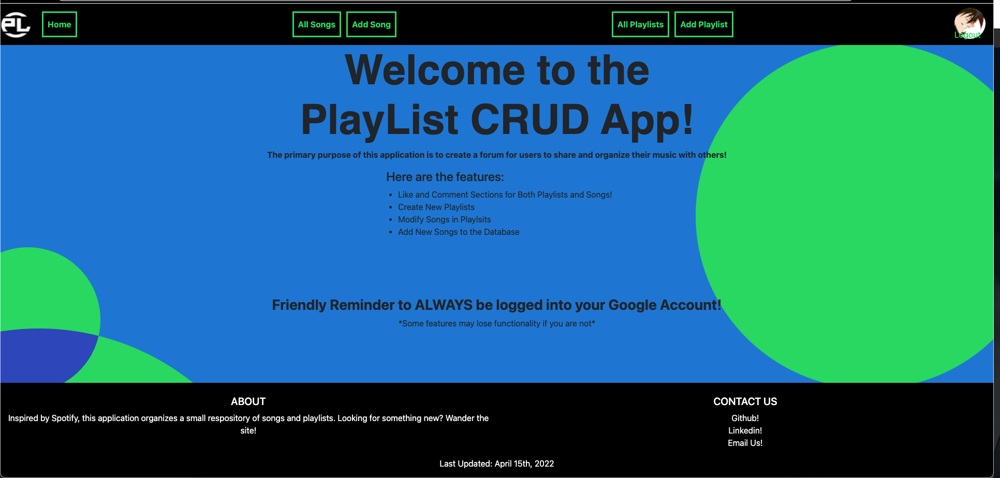
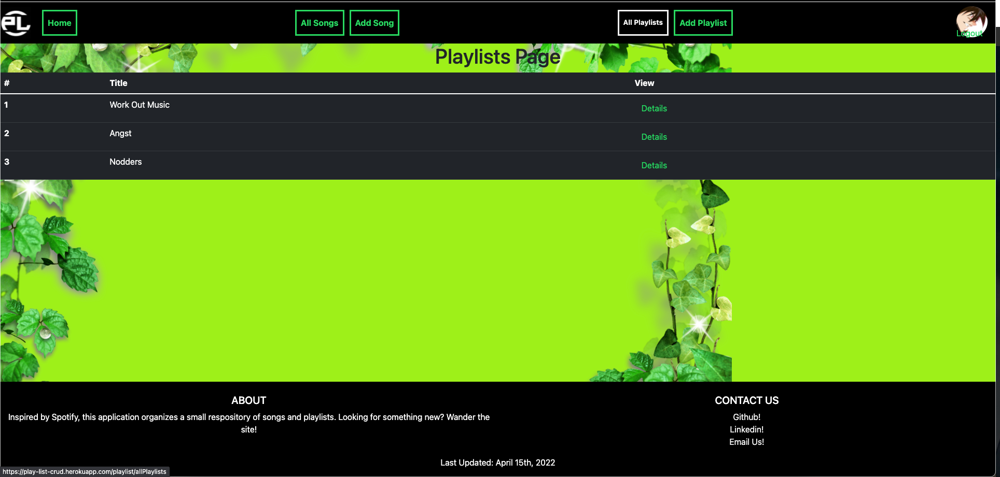
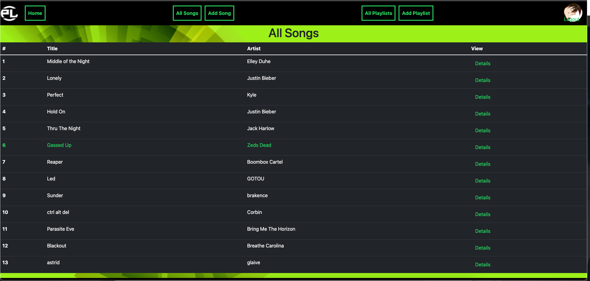
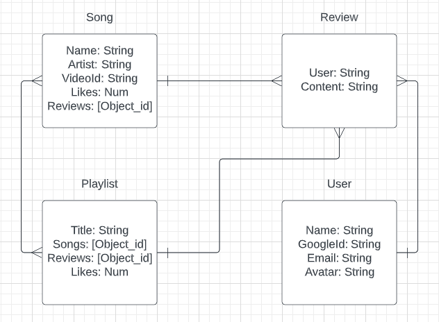
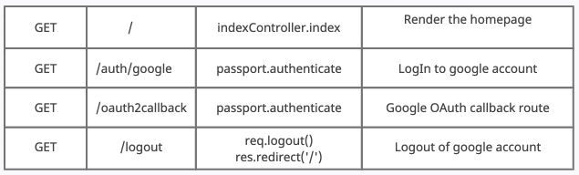
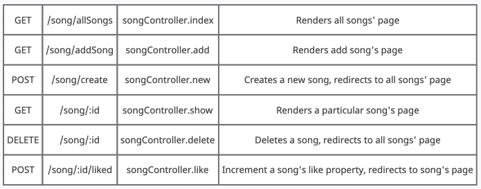
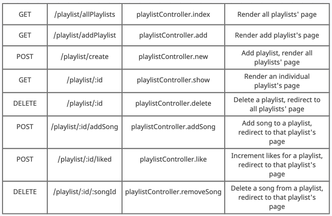
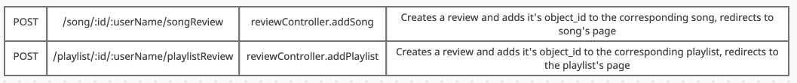

<h1> PlayList CRUD App! </h1>

 This application acts as an open source music share where anyone can modify songs, playlists,
  and reviews to the forum. The aesthetic draws most of its inspiration from Spotify and Youtube! 

<h2> Here's a Sneak Peak </h2>
<h3> Home Page </h3>

<h3> All Playlists </h3>

<h3> All Songs </h3>
 

 Excited to check it out? <a href="https://play-list-crud.herokuapp.com/"> Click Here! </a> 
 

<h2> Data Model </h2>

     
<h2> Routes </h2>
<h3> Index </h3>

     
<h3> Song </h3>

<h3> Playlist </h3>

     
<h3> Review </h3>

     
     
Technologies Used: JavaScript, Html, Css, Node.js, Express, MongooseDB, Google OAuth API, Youtube v3 API

Deployed On Heroku
Here's The Link!
<a href="https://play-list-crud.herokuapp.com/"> PlayList CRUD App </a>
 
<h2> Stretch Goals </h2>
<ul>
  <li>Make Playlists Associated to a User</li>
  <li>Make Reviews Deleteable</li>
  <li>Make Comments, playlists, and songs only deleteable by the user who created them</li>
</ul
